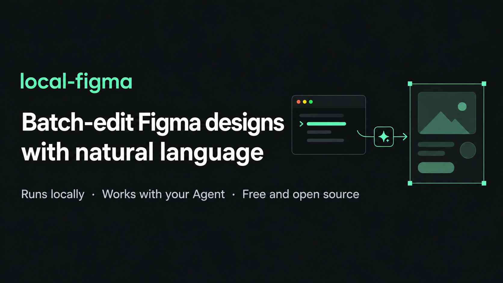
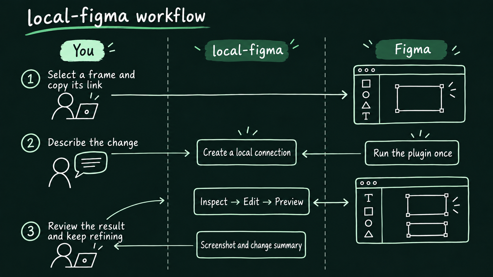
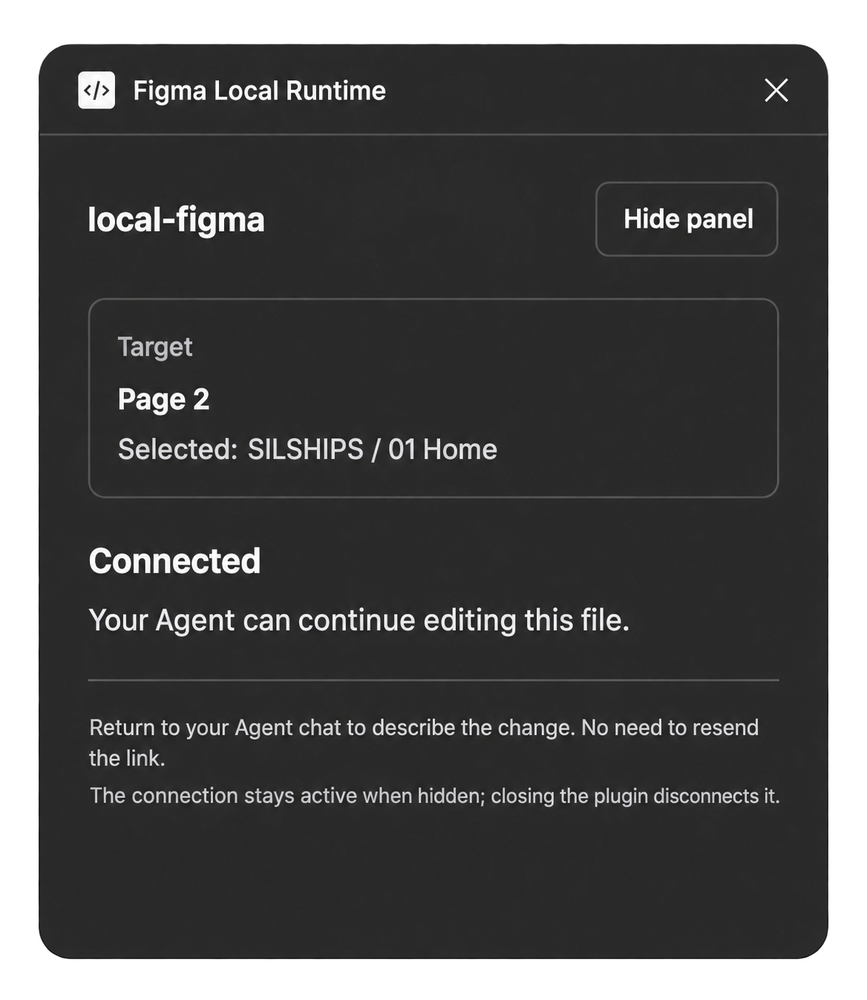
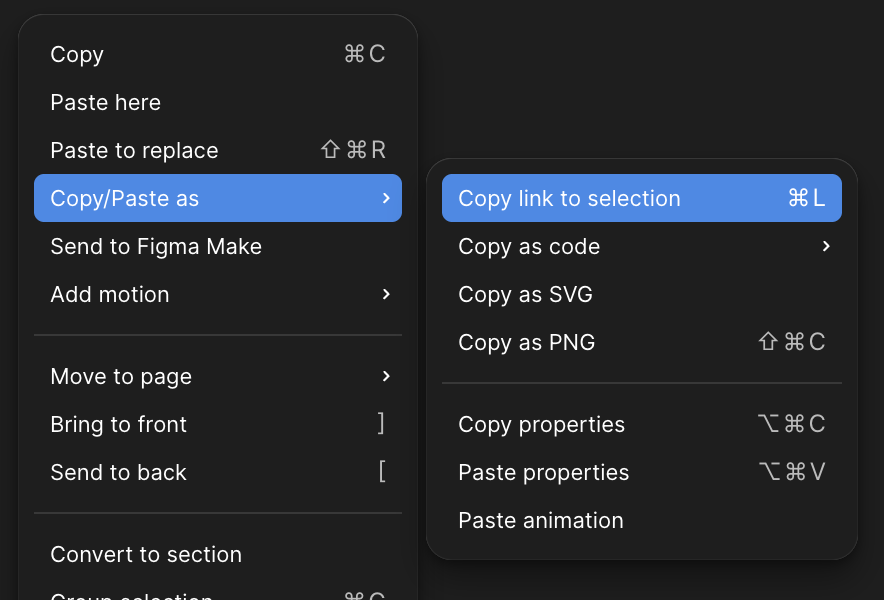
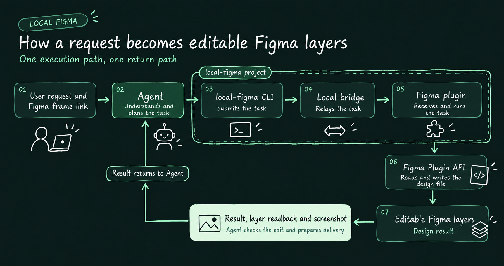

# local-figma

**Batch-edit Figma designs with natural language**<br>
Runs locally · Works with your Agent · Free and open source

[简体中文](README.md) | [English](README.en.md)


[](LICENSE)



## Why local-figma?

**AI can already write code. Why bother with design files?**

Vibe coding feels great when you get the first result. But without a design file, keeping layouts, styles, and page relationships consistent through repeated changes becomes harder. local-figma lets your Agent edit a design you can keep refining, compare alternatives, and confirm the result before you update the code. Future iterations have a clear reference.

**Figma already has AI features and MCP. Why a local tool?**

local-figma connects the Agent you already use to native Figma layers through a CLI and plugin running on your computer. Progress is visible in the plugin, and task records are stored locally so you can inspect results and recover interrupted work. The code is open source, so you can adapt it to your own workflow.

**Does it cost anything?**

local-figma is free under the Apache-2.0 license for personal and commercial use. Your AI assistant and Figma services follow their own pricing.

## What do you need before you start?

- **Figma Desktop**: Open a design file you can edit.
- **An AI assistant that can work on your computer (Agent)**: It needs to install tools, run commands, and inspect images. This guide calls it an Agent.

## Download and install directly

Requires **macOS, Node.js 22+ (including npm), and Figma Desktop**. Download [figma-local-runtime-0.1.0-alpha.3.tgz](https://github.com/denki-san/local-figma/releases/download/v0.1.0-alpha.3/figma-local-runtime-0.1.0-alpha.3.tgz); no repository clone or build is needed. Choose the `.tgz` release asset, not GitHub's “Source code” archives.

Open a terminal in the download directory and run:

```sh
npm install -g ./figma-local-runtime-0.1.0-alpha.3.tgz
figma-local help
mkdir -p ~/figma-local-project
cd ~/figma-local-project
figma-local init '<replace with a Figma frame link containing node-id>'
figma-local connect
```

The last command stays running and prints a `manifest.json` path. In Figma Desktop, choose **Plugins → Development → Import plugin from manifest**, import that file, and run **Figma Local Runtime**. Once it shows “已连接” (Connected), your Agent can start working. Keep the connection terminal and plugin running; use another terminal in the same project directory for subsequent commands.

To upgrade, inspect any running task, stop the old plugin and connection, install the new package, then run `figma-local connect` and open the plugin again. Preserve the project's `.figma-agent/` bindings and evidence.

## How does it work?

You select a frame, describe the change, and review the result. The Agent uses local-figma to read, edit, and preview the design.



*The first use requires importing and running a plugin. After that, you can keep refining the same frame through the Agent. Follow these steps to get started.*

### 1. Install the plugin

Send this message to your Agent:

> Please read the [local-figma README](https://github.com/denki-san/local-figma/blob/main/README.en.md) and [Agent guide](https://github.com/denki-san/local-figma/blob/main/docs/agent-quickstart.md), then help me install and connect local-figma.

The Agent will give you the location of the plugin manifest and guide you through these steps:

1. In Figma, find **Plugins → Development → Import plugin from manifest**.
2. Select the manifest provided by the Agent.
3. Run **Figma Local Runtime** from the Development plugins menu.
4. When the plugin shows **“已连接” (Connected)**, return to your conversation with the Agent.

If the Agent asks for a frame link during installation, copy one using the next step. If you cannot find the file or menu, tell the Agent exactly where you are stuck.

**Keep the plugin and the connection process started by the Agent running while you work.**



### 2. Select the frame to edit

In Figma, select the entire **Frame** you want to edit, then right-click the frame and choose:

**Copy/Paste as → Copy link to selection**

This copies a link to the selected frame, so the Agent knows exactly which area you want to change.



### 3. Describe your request and review the result

Send the frame link and your request together, for example:

> Frame link to edit: 【paste your Figma frame link】
>
> I want: 【for example, change the sign-up button text to “Register now” and leave everything else as it is】

When the Agent finishes, it will send you a screenshot and a summary of the changes. Check the result in Figma. If the task added navigation, click the buttons to test it too.

## How the workflow works

The Agent hands the task to the local CLI. The bridge passes it to the Figma plugin, which reads and writes layers through the Figma Plugin API. The Agent then reads back the result and a screenshot, checks them, and delivers the result to you.



*The dashed outline encloses the CLI, local bridge, and Figma plugin that are part of the local-figma project.*

## Introducing five use cases

| Task | What you get |
| --- | --- |
| **Design from scratch** | An editable, native Figma design based on your brief and references |
| **Refine an existing design** | Local changes that preserve its styles and components, with a before-and-after comparison |
| **Design to Code** | A running page based on the design, plus a visual comparison |
| **Code to Design** | An editable Figma design based on code and a running page |
| **Build an interactive prototype** | A Figma prototype with clickable navigation, back actions, overlays, and scrolling |

## Frequently asked questions

### 1. Do I need to write code?

For everyday use, you only need to describe your request, open the plugin when prompted, and review the result. The Agent handles installation and commands.

### 2. Why do I need an Agent?

local-figma connects to and operates Figma. Your Agent interprets your request, proposes a design approach, and decides how to make the changes.

### 3. What if the connection drops or the task takes a long time?

Send the plugin status or error message to your Agent. You can say:

> Please check whether the last edit finished before restoring the connection.

Wait for the Agent to verify the original task before continuing. This avoids doing the same edit twice.

### 4. How do I work on another frame or file?

Send the new selection link to your Agent. It will verify the target and reconnect if needed.

## Download and further help

Current preview release: **[v0.1.0-alpha.3](https://github.com/denki-san/local-figma/releases/tag/v0.1.0-alpha.3)**. Share this page with your Agent to get started.

- Verified multi-step tasks: [workflow plans, assertions, and recovery](docs/20260930-workflows.md)
- More ways to phrase a request: [task examples](docs/first-task.md)
- Installation and workflow instructions for Agents: [Agent guide](docs/agent-quickstart.md)
- Run the commands yourself: [manual setup guide](docs/quickstart.md)
- Build an extension: [extension interfaces](docs/extensions.md)
- Version changes and data handling: [release notes](docs/releases/20261001-alpha-3.md) · [security](SECURITY.md)

Licensed under [Apache-2.0](LICENSE).
