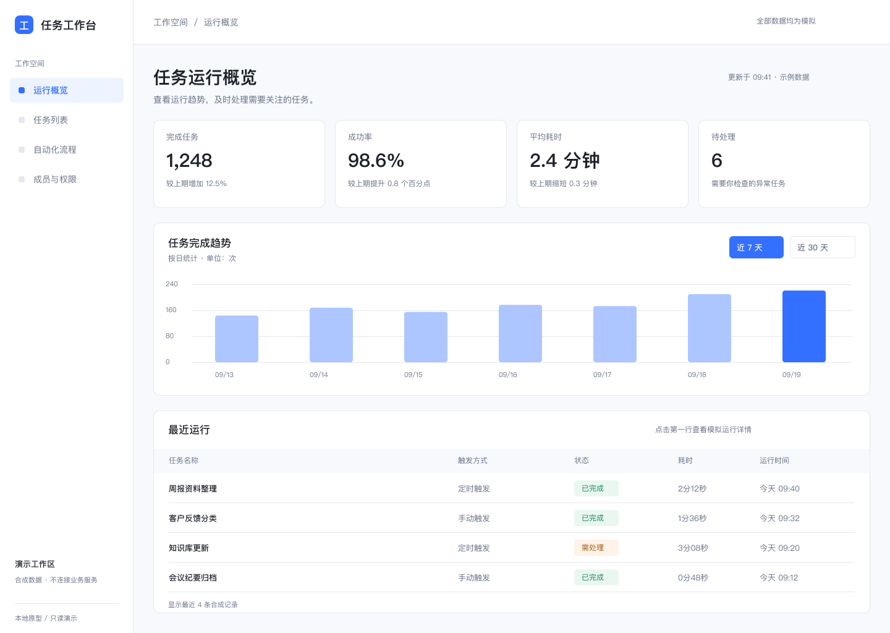

# local-figma


让你的 Agent 在本机读取、修改和验证原生 Figma 设计稿。

CLI、本机桥接和 Development Plugin 连接成一个编辑循环：理解当前设计 → 小范围修改 → 读回与截图 → 实际点击验收。文字、图层和组件保持可编辑，无需独立托管服务。

[快速开始](docs/quickstart.md) · [五场景验收](docs/scenario-acceptance.md) · [首版范围](docs/p0-scope.md) · [安全说明](SECURITY.md) · [贡献指南](CONTRIBUTING.md)

> 当前为 `0.1.0-alpha.1` 本地开发版，尚未发布 npm。包名暂为 `figma-local-runtime`，命令为 `figma-local`。五场景验收、稳定性与公开分发审查正在进行；下表区分产品目标和已验证能力。



真实 Figma 导出：1440×1024，原生文字、指标组件和可点击详情。此图展示设计示例，运行数据全部为模拟。[复现脚本与验收步骤](examples/dashboard/README.md)

## 五种任务

| 任务 | 交付目标 | 当前验收状态 |
| --- | --- | --- |
| 从零设计 | 结合需求、参考和现有设计语言生成原生页面 | 参考驱动概览案例8.2/10，公开脚本原样执行、结构读回及限定主路径实点通过 |
| 已有稿精修 | 保留组件关系，调整文案、间距和局部布局 | 排版与实例覆盖本地案例8.0/10，滚轮/键盘及长文本仍有限制 |
| Design to Code | 原稿对应的高保真 HTML、素材和关键交互 | 复杂原稿本地案例暂评8.1/10；另有公开Dashboard的导出与HTML复现，固定桌面截图对照及主路径实测通过；不声明像素完全一致 |
| Code to Design | 运行网页对应的原生画板和本地组件 | 复杂原稿的文字、素材、组件联动已实测，Auto Layout及最终评分待验收；公开指标行另有四实例与横向Auto Layout复现、读回及截图证据 |
| 交互原型 | 跳转、返回、弹层、组件状态、滚动 | 本地复杂主路径内部评审8.3/10；另有公开合成流程，滚动、确认切换、取消复位、提交与返回已实点通过 |

首版限定 macOS、Figma Design、单文件和单个写入 Agent。双向转换逐页完成，暂不建设通用转换器或自动双向同步。8 分属于具体案例评审，无法代表任意任务或像素完全一致。

## 安装与连接

准备好 Figma Desktop、有编辑权限的文件，以及能执行本地任务的 Agent。把目标页面、画板或元素的链接和需求一起发给 Agent：

> 帮我安装并连接 local-figma。目标是【Figma 链接】，我想【修改需求】。请处理依赖与本机连接，只在需要我在 Figma 中操作时告诉我。

Agent 负责检查依赖、绑定链接和准备连接。首次按提示在对应 Figma 文件运行小插件；当前 Alpha 首次仍需手动导入开发插件，Agent 提供文件位置和具体操作。小窗口显示目标、选区及连接状态，无需在独立窗口重复粘贴链接或点击连接。

连接后，在绑定范围内选中内容，回到对话继续说需求。同一目标无需重复发链接；换文件或超出范围时再提供新链接。首次连接仍需要链接，尚未支持无链接自动绑定选区。

<details>
<summary>供 Agent 查阅：安装与连接命令</summary>

运行依赖为 Node.js 22+，由 Agent 检查和准备。当前安装测试覆盖 macOS；其他系统尚未验收。

在源码目录执行：

```sh
npm install -g .
```

进入你的项目目录，使用自己提供的目标画板或节点链接：

```sh
figma-local init 'https://www.figma.com/design/FILE/NAME?node-id=1-2'
figma-local connect
```

在 Figma 的 Plugins → Development → Import plugin from manifest 中导入终端返回的 manifest，运行插件。保持桥接终端与插件窗口打开。

另开终端，在同一项目目录执行：

```sh
figma-local doctor
figma-local inspect
figma-local wait <返回的任务ID> --timeout 30
```

提交只代表入队；result 包装对象中的 `result.ok` 表示执行结果。无结果时先检查连接与文档状态，避免重放脚本。安装权限、离线分发和故障处理见 [快速开始](docs/quickstart.md)。

`wait` 等待结果与终态日志一致；超时退出 2，保留原任务继续核查，不重放脚本。也可用 `result <任务ID>` 立即读取当前证据。

绑定整页时，`inspect` 先返回顶层目录。选取目录中本次要操作的节点，通过 `inspect --node 1:2`、`preview --node 1:2` 或 `run change.js --node 1:2` 进入局部范围，无需重启插件。节点必须位于原绑定范围内。

</details>

## 向 Agent 提出任务

连接后直接向 Agent 描述需求。Agent 负责整理 brief、执行命令和查看截图，你负责确认方案与成果；无需手填 JSON 或编写脚本。可直接复制 [首次任务提示](docs/first-task.md)。

### 现有稿精修

适用于已有页面、组件和设计系统，调整文字、间距、截断、局部布局或交互。

```sh
figma-local guide refine
figma-local guide-check refine
```

上面的命令可交给 Agent 执行。告诉它具体问题、修改范围和保护区域，由它整理 brief，先 inspect、design-system、preview，复用现有资源，确认局部方案后执行小批修改。你查看前后截图与修改摘要，必要时确认真实点击效果。

### 从零设计高质量 UI

在用户授权文件中准备空白 Frame，绑定其链接：

```sh
figma-local guide design
figma-local guide-check design
```

准备主要用户任务、真实内容、目标尺寸与状态要求。建议提供 2–3 张参考图，逐张说明借鉴点、避开点和使用权限；参考图保存在本地并交给 Agent 查看。没有图片时可先填写文字视觉方向。

先比较两种结构方向，用户选择后确定排版、颜色、间距与组件规则。先完成一个关键区域，通过截图评审后扩展页面，再检查长内容、空态、错误态与主要路径。

CLI 提供执行与证据能力；成稿质量由内容、设计判断和视觉迭代共同决定。详见 [场景指南](docs/workflows.md)、[合成 brief 示例](examples/briefs/README.md) 与 [设计评审清单](docs/design-review.md)。

可从[原生任务概览示例](examples/dashboard/README.md)复现参考驱动设计：脚本创建两种时间范围、复用指标组件和可点击详情，内容全部为合成数据。运行及验收命令交给 Agent 执行。

### 双向转换与原型

可以直接给 Agent 描述目标：

- “把这个页面还原成同尺寸 HTML，保留真实文字和素材，检查关闭、展开和滚动。”
- “把这个运行中的网页重建成 Figma 原生画板，重复卡片做成本地组件，验证实例修改。”
- “连接这几张画板的主路径，补充返回和确认弹层，实际点击后交付原型。”

对应的开发引导为 `guide design-to-code`、`guide code-to-design` 和 `guide prototype`。引导入口检查任务资料，实际设计、实现和视觉校正由 Agent 完成。

## 当前能力

| 能力 | 当前范围 |
| --- | --- |
| 连接与目标 | 用户 URL 显式绑定、绑定范围内 --node 选择、回环认证、doctor 诊断、单插件会话 |
| 读取与预览 | inspect 子树、preview PNG、目标已用样式/变量/组件发现 |
| 执行 | 可信 JavaScript 函数体、修改前快照落盘确认、一次交付、声明式高风险插件确认 |
| 高层编辑 | 当前选区的文字、固定Frame尺寸/间距、单层纯色填充；合成色块真实改色与恢复通过，完整节点及恢复截图一致 |
| 字体编辑 | `font --size 20` 或 `font --family Inter --style Bold`；单一文字选区，加载后复核，保护锁定、样式/变量及主组件；真实PingFang SC字号/字重修改及恢复通过，跨字体家族待验收 |
| 对齐与分布 | `align left`、`distribute horizontal` 等方向；同一自由布局Frame内多选，按选区边界操作，完整父Frame快照；传输集成通过，真实色块顶部对齐/水平分布与恢复通过，其它方向待实测 |
| 简单原型连接 | `prototype <目标Frame的ID>` 由Agent调用，给当前单选图层新增同页点击跳转；已有点击交互拒绝覆盖，保留其它触发；传输集成及独立测试画板真实点击通过，交互已恢复 |
| 复用本地组件 | `instance <同页主组件ID>` 由Agent调用，在当前独立Frame追加实例；普通布局检查空间并放在已有内容下方，水平/垂直Auto Layout按容器追加；拒绝可能影响选区外布局的嵌套Hug以及会移动锁定图层/主组件的追加；普通Frame和固定垂直Auto Layout已实测，水平布局仍待真实验收 |
| 证据 | 脚本与结果留存、离线 history/result、子树 diff、有限结构 validate |
| 引导 | 五种任务的 brief、资料缺口检查、参考与方向选择流程 |
| 故障处理 | 结果回传重试、部分失败读回、桥接残留恢复、Undo 边界记录 |

实例属性入口：Agent 可用 `props <完整属性名> --value <文字或true/false>` 覆盖单选独立实例的 TEXT / BOOLEAN 属性。保留主组件和其它属性，拒绝变量绑定、嵌套共享定义及外层自动布局重排风险。局部模拟检查及 Untitled 独立实例的文字/显隐覆盖、主组件默认值读回和截图已通过；VARIANT / INSTANCE_SWAP 未开放。

颜色变量入口：Agent 可用 `bind-fill <已确认的颜色变量ID>` 将已有颜色变量绑定到当前单选图层的单个纯色填充。拒绝样式覆盖、共享组件定义、锁定区域及等待期间的选区变化；不创建或修改变量定义。4 项局部模拟检查通过；Untitled 当前没有颜色变量，真实绑定验收等待独立测试变量创建授权。

完整命令以 `figma-local help` 为准。读取覆盖见 [inspect 说明](docs/inspect-coverage.md)，输出字段见 [协议合同](docs/protocol.md)，进度见 [实现状态](docs/implementation-status.md)。

## 差异化重点

本项目将明确目标、写入前证据、一次交付、离线核查和五种任务引导组合为可追踪的编辑循环。CLI 与 JSON 接口支持不同 Agent；运行时零 npm 依赖，无独立托管服务或遥测。

同类项目也具备原生编辑、设计上下文或本地运行能力。本项目的定位强调上述工作流组合，独有性和效率优势仍需同题实测。来源与比较范围见 [同类项目矩阵](docs/research/landscape-matrix.md)。

## 使用边界

- `run` 具有插件允许的文档访问能力；目标复核用于防误操作，无法隔离恶意脚本。仅执行审阅过的可信本地代码。
- `--high-risk` 由调用方声明，工具尚未自动识别脚本风险；Agent 不应代用户点击确认。
- 结构快照覆盖有限属性，diff 只比较绑定子树；视觉、交互和用户验收需要独立完成。
- `recover` 清理已退出桥接的残留状态，不恢复设计内容。完整文档 rollback 与 transaction 尚未实现；Undo 边界调用也无法证明恢复已完成。
- `guide-check` 检查资料完整性，不验证设计质量、版权或真实用户同意。
- 证据保存在默认 Git 忽略的 `.figma-agent/`，包含脚本和设计内容。分享前脱敏。图片交给外部模型时需另行确认其数据处理方式。
- 当前需要 Development Plugin 的 file key 读取能力；无法核验目标时拒绝执行。
- 默认开发 manifest 缺少 Figma 分配的插件 ID，私有 pluginData API 不可用；节点映射保存在本地证据中，doctor 会给出提示。

安全详情见 [SECURITY.md](SECURITY.md)。当前首版以 [P0 范围](docs/p0-scope.md)、[五场景验收](docs/scenario-acceptance.md) 和[发布门槛](docs/release-readiness.md)为准。后台安装与长期稳定性仍待完成。

## 开发与验证

```sh
npm ci
npm run check
npm test
```

测试覆盖真实 CLI、回环 HTTP、插件代码模拟、故障注入、输出合同与 tarball 隔离安装。Figma API 使用模拟对象的测试无法证明真实文档行为。Ajv 为开发测试依赖，终端用户安装无需该依赖。

已配置 macOS 上的 Node.js 22/24 CI，采用手动触发；完整回归须经维护者确认，普通推送不会自动运行全套。尚未进行首次远程运行。测试通过徽章仅在核实远程工作流结果后接入；当前未展示下载量、覆盖率或许可证徽章。徽章格式参考 [GitHub 官方说明](https://docs.github.com/en/actions/how-tos/monitor-workflows/add-a-status-badge) 和 [Shields.io](https://shields.io/docs/static-badges)。

已有一次真实桌面验收，覆盖原生文字、Auto Layout、三行截断、局部修改、截图及单字段故障恢复；验证边界见 [桌面验收记录](docs/desktop-acceptance.md)。

贡献说明见 [CONTRIBUTING.md](CONTRIBUTING.md)。长期方案、历史经验与设计决策保留在 [docs](docs/open-source-plan.md)，其中规划能力需对照当前实现状态。

## 许可证与发布

已决定采用 Apache-2.0，[标准许可证正文](LICENSE)已加入；项目版权署名仍待确认。当前尚未满足公开发布门槛，也未执行远程仓库或 npm 发布。
