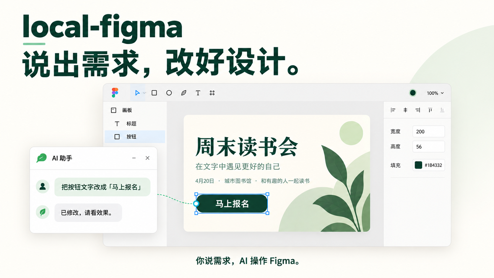
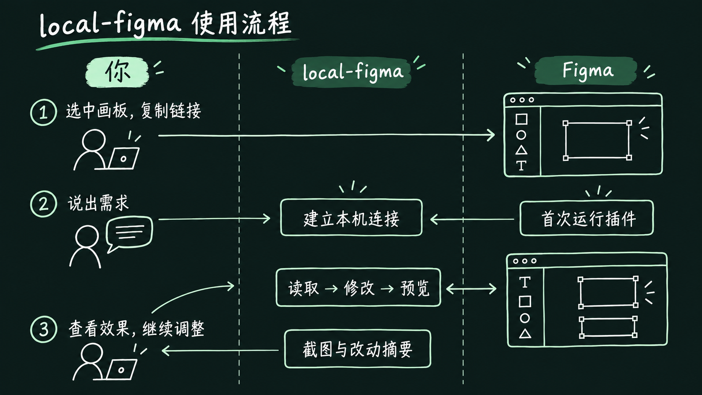
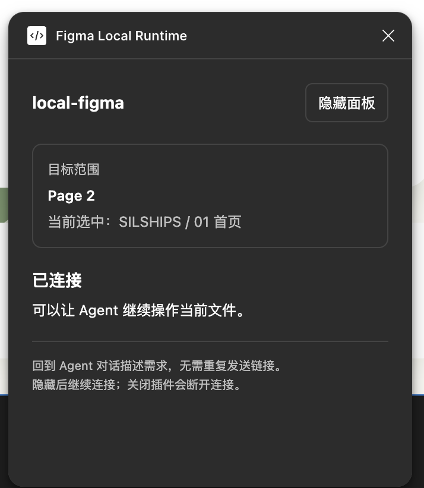
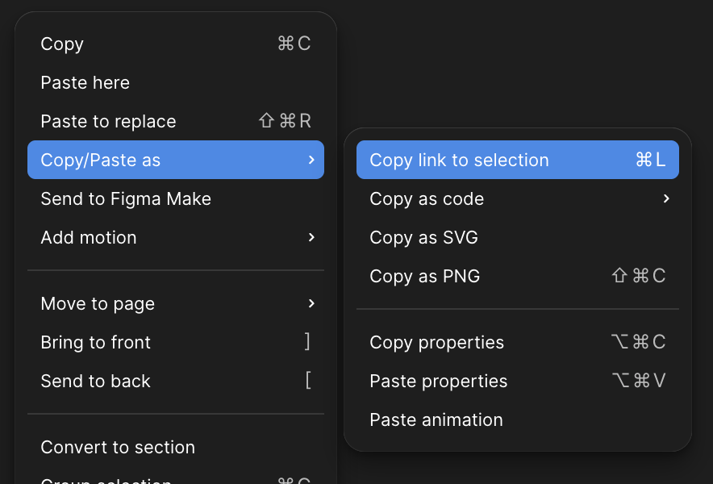
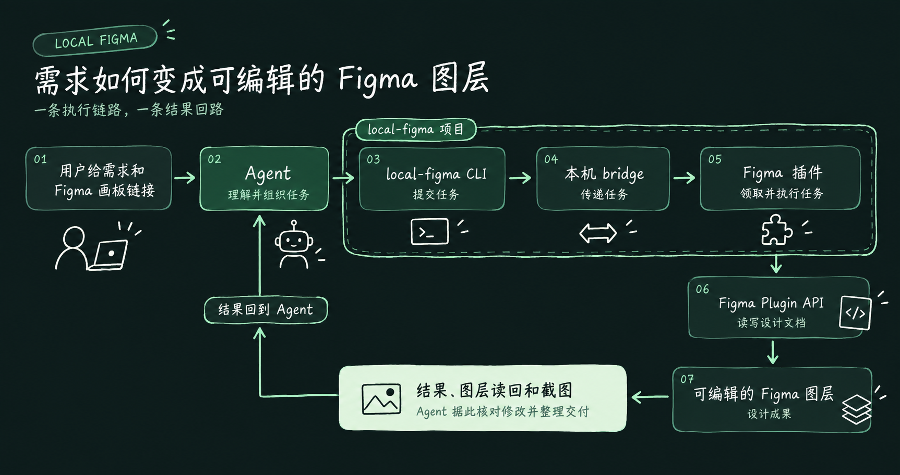

# local-figma

**用自然语言快速批量修改 Figma 设计稿，并保持原有样式一致。** 
把画板链接和需求交给 Agent，完成后查看原生可编辑的结果。

[简体中文](README.md) | [English](README.en.md)

## 开始前，需要准备什么？

- **Figma 桌面应用**：打开你有编辑权限的设计文件。
- **能操作本机的 AI 助手（Agent）**：它需要能安装工具、执行命令、查看图片。下文统一称为 Agent。

## 怎么用？

你负责选画板、说需求、看效果；Agent 通过 local-figma 读取、修改和预览设计。

*首次使用需要安装并运行插件，之后就可以围绕画板继续对话、调整效果。具体操作如下。*

### 1. 安装插件

把这段话发给 Agent：

> 请阅读 [local-figma 的 README](https://github.com/denki-san/local-figma) 和 [Agent 操作指南](https://github.com/denki-san/local-figma/blob/main/docs/agent-quickstart.md)，帮我安装并连接 local-figma。

Agent 会给你一个插件配置文件的位置，并带你完成这几步：

1. 在 Figma 菜单中找到 **Plugins → Development → Import plugin from manifest**。
2. 选择 Agent 给你的配置文件。
3. 在开发插件菜单中运行 **Figma Local Runtime**。
4. 等插件显示 **「已连接」**，回到 Agent 对话继续。

安装过程中需要画板链接时，按下一步复制给 Agent。找不到文件或菜单时，直接告诉它你卡在哪一步。

**使用期间，保持插件和 Agent 启动的连接程序运行。**

### 2. 选好要修改的画板

在 Figma 中选中要修改的整块画板，也就是 **Frame**，再右键点击画板，依次选择：

**Copy/Paste as → Copy link to selection**

这样复制的是所选画板的链接，Agent 才知道你要改哪一块。

### 3. 开始许愿、看成果

把画板链接和需求一起发给 Agent，例如：

> 我要修改的画板链接是：【粘贴 Figma 画板链接】
>
> 我想：【例如，把报名按钮的文字改成「马上报名」，其他地方保持原样】

Agent 完成后，你会收到截图和修改说明。回到 Figma 检查一下；如果做了页面跳转，也点击按钮试试效果。

## 工作流如何工作

Agent 把任务交给本地 CLI；桥接服务把任务传给 Figma 插件；插件通过 Figma Plugin API 读写图层。Agent 再读回结果和截图，检查后交付给你。

*虚线框圈出 local-figma 项目中的 CLI、本地 bridge 和 Figma 插件。*

## 介绍五种使用场景

| 任务 | 最终得到的结果 |
| --- | --- |
| **从零设计** | 根据需求与参考制作的原生可编辑设计稿 |
| **已有稿精修** | 保留现有风格与组件的局部调整，以及前后对比 |
| **Design to Code（设计稿转代码）** | 基于设计稿实现的可运行页面，以及视觉对比 |
| **Code to Design（代码转设计稿）** | 从代码和运行页面还原的原生可编辑设计稿 |
| **制作交互原型** | 可点击、可跳转、可返回，并支持弹层与滚动的 Figma 原型 |

## 常见问题

### 1. 我需要会写代码吗？

日常使用只需要描述需求、按提示打开插件、检查效果。安装和命令由 Agent 处理。

### 2. 为什么还需要 Agent？

local-figma 负责连接和操作 Figma；理解你的需求、提出设计方案、决定如何修改，由你使用的 Agent 完成。

### 3. 显示断开连接，或者等了很久怎么办？

把插件状态或报错发给 Agent，可以这样说：

> 请先检查上一次修改有没有完成，再帮我恢复连接。

等它核对完再继续，避免同一个操作做两遍。

### 4. 想修改另一个画板或文件怎么办？

把新画板的选区链接发给 Agent；它会核对目标，并按需重新连接。

## 下载和更多帮助

当前试用版本：**[v0.1.0-alpha.2](https://github.com/denki-san/local-figma/releases/tag/v0.1.0-alpha.2)**。把本页发给 Agent，让它按上面的流程帮你开始。

- 参考更多需求说法：[任务示例](docs/first-task.md)
- 给 Agent 看的安装和操作步骤：[Agent 操作指南](docs/agent-quickstart.md)
- 自己运行命令：[手动安装指南](docs/quickstart.md)
- 开发扩展：[扩展接口](docs/extensions.md)
- 了解版本变化与数据处理：[版本说明](docs/releases/v0.1.0-alpha.2.md) · [安全说明](SECURITY.md)

本项目采用 [Apache-2.0](LICENSE) 许可证。
