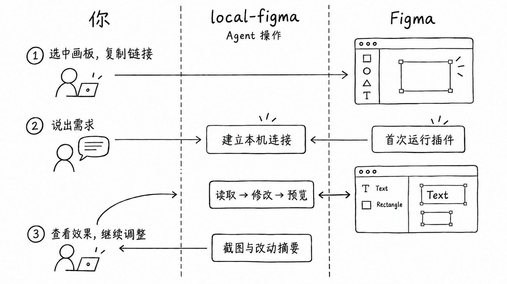

# local-figma

把 Figma 画板链接和需求交给 Agent，让它在本机读取、修改并检查原生可编辑的设计稿。你负责提出需求、在首次使用时运行插件，以及确认最终效果。

当前试用版为 [v0.1.0-alpha.1](https://github.com/denki-san/local-figma/releases/tag/v0.1.0-alpha.1)。需要 macOS、Node.js 22+、Figma Desktop、目标文件的编辑权限，以及能执行本地命令和查看图片的 Agent。

上图由本工具在 Figma 中制作并导出；文字、图层和原型连接保持可编辑，数据均为合成内容。

## 第一次使用：三步

1. 在 Figma 中选中要修改的 Frame，复制所选对象的链接。链接中应包含 `node-id`。
2. 把链接和需求发给 Agent。可以直接复制这段话：

   > 请先阅读 https://github.com/denki-san/local-figma 的 README 和 https://github.com/denki-san/local-figma/blob/main/docs/agent-quickstart.md，帮我安装并连接 local-figma。目标画板是【Figma 选区链接】，我想【具体需求】。先查看画板并给我简短方案；确认后局部修改。需要我在 Figma 中操作时，请给我具体步骤。完成后展示结果截图和改动摘要。

   首次连接时，Agent 会给出插件文件路径。你需要在目标文件中通过 Figma Desktop 的 Plugins → Development 导入并运行插件；连接期间保持桥接终端和插件运行。

3. 看 Agent 交付的截图与改动摘要，再到 Figma 中确认效果。想继续调整时，指出具体区域即可。

图中间的 local-figma 操作由 Agent 完成。你只需要提供目标、说明需求并检查结果；首次按提示在 Figma 中运行插件。

已经连接后，可以继续在同一绑定范围内提出修改需求。换文件或处理绑定范围以外的内容时，请提供新链接。[更多可复制的任务示例](docs/first-task.md)涵盖精修、新设计、代码转换和交互原型。

## 能做什么

- 已有稿精修：调整文字、字体、颜色、布局、对齐和组件属性，并查看修改后的画板。
- 从零设计：提供页面目标、真实内容与参考图；Agent 先给设计方向，再逐步制作可编辑图层。
- 简单交互原型：制作点击跳转，并在 Figma 中检查操作路径。
- Design to Code / Code to Design（实验性）：Agent 负责代码实现和运行页面对照；local-figma 负责 Figma 侧的读取、修改与检查。

每次交付请让 Agent 展示结果截图、修改摘要和需要你在 Figma 中检查的地方。做交互原型时，还要实际点击主要路径。

## 安装、帮助与安全

Agent 从 [Release 安装包](https://github.com/denki-san/local-figma/releases/tag/v0.1.0-alpha.1)安装，并按[Agent 操作指南](docs/agent-quickstart.md)连接、检查和交付。想自己操作命令，可看[手动快速开始](docs/quickstart.md)。完整命令以 `figma-local help` 为准，开发者可查阅[输出协议](docs/protocol.md)和[贡献指南](CONTRIBUTING.md)。

连接中断或等待超时时，让 Agent 先核对原任务结果和 Figma 画布，再继续。脚本、文字和截图会保存在本地 `.figma-agent/`；分享该目录前请检查内容。更多信息见[版本说明](docs/releases/v0.1.0-alpha.1.md)和[安全说明](SECURITY.md)。

本项目采用 [Apache-2.0](LICENSE) 许可证。
